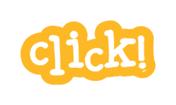

# Click<em>!</em> Mod

[[https://snap.berkeley.edu](https://click-blocks.vercel.app/snap.html)][click]

**[Try Click<em>!</em> Now](https://click-blocks.vercel.app/snap.html)**

a visual, blocks based programming language
inspired by Scratch and forked from Snap! (http://snap.berkeley.edu/)

written by Jens Mönig and Brian Harvey originally and being updated and modded by Lorenzo (DetectiveSheepy) 
jens@moenig.org, bh@cs.berkeley.edu, farrancelorenzo@gmail.com

## Click<em>!</em> Community

This repository contains the source code for Click<em>!</em> IDE.

[snap]: https://click-blocks.vercel.app/snap.html
[clickcloud]: coming soon ;)
[forum]: coming soon ;)

## Security

If you have security concerns, please do not post them publicly.
Please reach out to us at [farrancelorenzo@gmail.com](mailto:farrancelorenzo@gmail.com).

## Documentation

The definitive source of how to use Click! is the [Snap! Manual](help/SnapManual.pdf).

* [API.md](docs/API.md) describes the API for modifying the Snap! interface.
* [Extensions.md](docs/Extensions.md) describes the basic interface for building JavaScript extensions for Snap!
* [Migrating.md](docs/Migrating.md) gives guidance for older extensions to migrate to Morphic 2 and Snap! v6.
* [Offline.md](docs/Offline.md) has instructions for running Snap! as a progressive web application.

_Please read the [Contribution Guidelines](docs/CONTRIBUTING.md) before making an issue or pull request. Thanks!_

## License
Copyright (C) 2008-2025 by Jens Mönig and Brian Harvey

Snap! is free software: you can redistribute it and/or modify
it under the terms of the GNU Affero General Public License as
published by the Free Software Foundation, either version 3 of
the License, or (at your option) any later version.

This program is distributed in the hope that it will be useful,
but WITHOUT ANY WARRANTY; without even the implied warranty of
MERCHANTABILITY or FITNESS FOR A PARTICULAR PURPOSE.  See the
GNU Affero General Public License for more details.

You should have received a copy of the GNU Affero General Public License
along with this program. If not, see <https://www.gnu.org/licenses/>.

Want to use Snap! but scared by the open-source license? Get in touch with us,
we'll make it work.

Click! is a fork of Snap. Liscences above apply to Snap!, but I will keep them there anyways because I don't wanna be sued and don't know how to use it.
